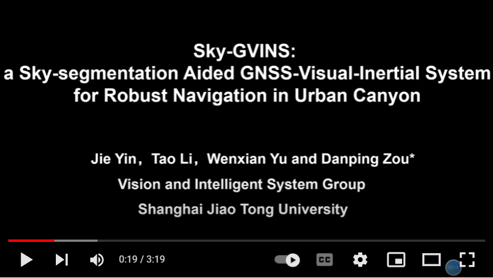
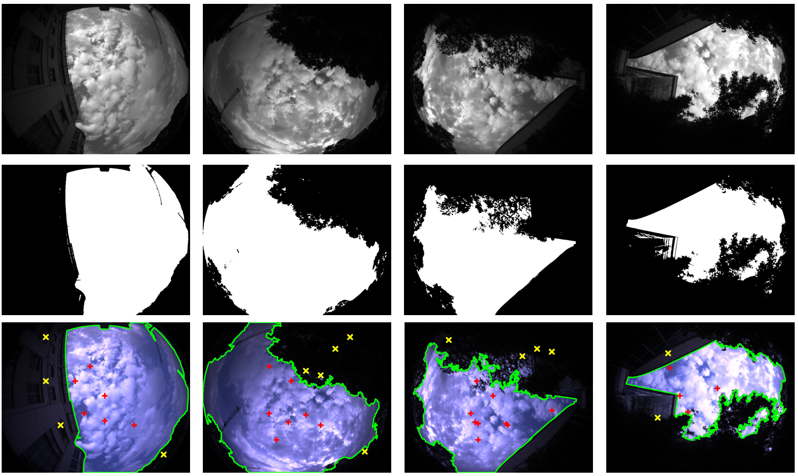
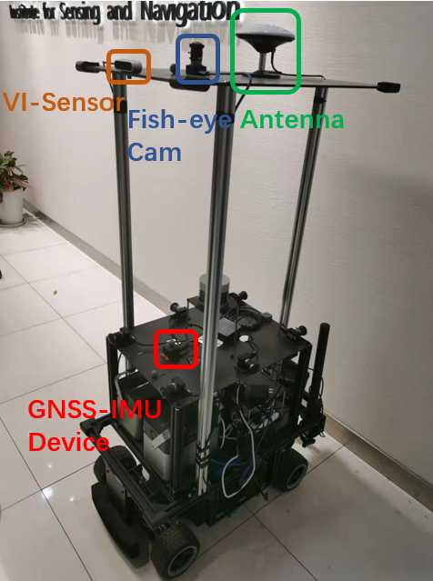
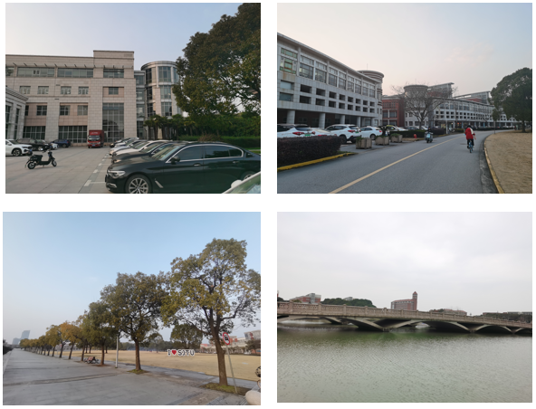

# Sky-GVINS
Sky-GVINS: a Sky-segmentation Aided GNSS-Visual-Inertial System for Robust Navigation in Urban Canyons [paper link](https://doi.org/10.1080/10095020.2023.2191649 )

## Abstract:
Multi-sensor fusion is a new developing trend in the field of SLAM (Simultaneous Localization and Mapping) for higher accuracy and better robustness in highly diverse environments. Among them, SLAM systems integrating GNSS (Global Navigation Satellite Systems) are drawing increasing attention for a global and continuous localization solution. Nonetheless, in dense urban environments, these GNSS-based SLAM systems will suffer from the NLOS (Non-Line-Of-Sight) measurements, which might lead to a sharp deterioration in location results. 

In this paper, we segment the sky-pointing image to improve GNSS measurement reliability for more accurate position estimation. Based on a recent work called GVINS which integrates GNSS, images and inertial information, we present Sky-GVINS: a sky-segmentation aided GNSS-Visual-Inertial system. Firstly, we adopt the global threshold method to segment the acquired fish-eye sky-pointing image to sky regions and non-sky regions. And then we back-projection satellites to the image using the geometric relationship between satellites and the camera. After that, we filter satellites in non-sky regions to eliminate NLOS signals for a more accurate position calculation. A sky segmentation test is conducted for different segmentation algorithms, in which the Otsu algorithm reports the highest classification rate and calculation efficiency. To test the effectiveness of Sky-GVINS, we construct a ground robot and carry out extensive real-world experiments on campus. Experimental results demonstrate that our methods effectively improve the location accuracy both in open-sky and dense urban environments compared to the baseline method. We make a detailed analysis of the experiment and point out the direction that can be further optimized for future research. For the benefit of the research community, the source code and datasets in this work will be made public. 

## Contributions

**Sky-GVINS** is a a Sky-segmentation Aided GNSS-Visual-Inertial System for Robust Navigation in Urban Canyons. The system framework is adapted from [GVINS](https://github.com/HKUST-Aerial-Robotics/GVINS). The main contributions are summarized as follows:

- We introduce a lightweight method that uses the global threshold algorithm on the sky-pointing images to separate LOS and NLOS signals. Our approach is efficient and effective, which can be easily extended to other GNSS-based systems.
- We propose a robust SLAM system that can obtain accurate global state estimation robustly both in dense urban environments and open-sky regions, which outperforms other existing systems in real-world experiments. 
- We present a large-scale sky segmentation dataset with manually marked labels and a multi-sensor SLAM dataset with accurate ground truth trajectories. We will make them public, facilitating tests of sky segmentation algorithms and GNSS/SLAM systems in urban canyons.

**Video:**

##  Experiments

###  Sky Segentation Test

Our sky segmentation datasets with mannually labeled GT are released in the following link [Sky-Seg(TBD)](TBD)

Figure 1. Results of Sky Segmentation and Back Projection. Images in the first row are grey-scale images after blurring. Images in the second row are after thresholding. Images in the third row are sky segmentation results, where green borders represent the border of sky regions and non-sky regions, red points represent LOS satellites, and yellow points represent NLOS satellites.

###  Real-world Experiments

We constructed a ground robot as shown in Figure 2. 

Figure 2. Acquisition Platform

To fully evaluate our proposed system, we operated our robot cross on the Shanghai Jiao Tong University campus and simultaneously recorded experimental trajectories in various scenarios as shown in Figure 3.

Figure 3. Different Scenarios

##  Acknowledgements
This work is supported by NSFC(62073214). Authors from SJTU hereby express our appreciation.

